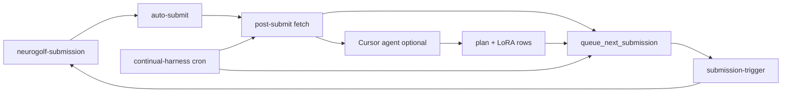

# Why submissions stopped + continual harness fix

**Date:** 2026-07-01  
**Latest Kaggle:** **965.42** (submission-5, 74 tasks)

---

## What happened

Submissions did **not** fully stop — submission-5 landed **965.42** (+24.67 vs 940.75) ~2 days before the screenshot. The **loop** stalled after that:

| Cause | Effect |
|-------|--------|
| **`submission_lane.py` bug** | `work_dir()` returned stale `2026-06-19/submission-1` (orphan `plan.md`) instead of submission-6 |
| **AGENT_STATE gate** | Docs said “wait for s5 public score before s6” while post-submit never wrote `kaggle_score_actual` |
| **Cursor-only chain** | `trigger_cursor_agent.py` exits 0 when `CURSOR_API_KEY` unset — no fallback |
| **No cron** | Loop was event-driven only; one missed post-submit = idle lane |
| **LoRA GHA cancellations** | Concurrent pushes cancelled in-flight train jobs |

---

## Fixes (this session)

1. **`work_dir()`** — skip folders at or behind `latest_submitted` (lane now points to submission-6).
2. **`scripts/queue_next_submission.py`** — writes `.github/triggers/submission-*.json` without Cursor API.
3. **`neurogolf-post-submit.yml`** — queues next run after every grade.
4. **`neurogolf-continual-harness.yml`** — cron every 6h: queue + backfill missing `kaggle_score_actual`.
5. **submission-6** — `run_submission_2026-06-26_s6.py` + trigger JSON pushed.
6. **LoRA train** — `concurrency.cancel-in-progress: false` to stop duplicate-cancel storms.

---

## Continual loop (target architecture)

Inspired by **Continual Harness** (strategy-from-others) and **ARC-AGI-3 LoRA cache bridges** (July notebook):



**No laptop:** GHA macos/ubuntu runners hold the lane. Cursor agent is optional enrichment, not a hard dependency.

### ARC-AGI-3 inspiration (next)

| ARC-AGI-3 pattern | NeuroGolf analogue |
|-------------------|-------------------|
| Train LoRA → distill to `HYPOTHESIS_LORA_CACHE` in notebook | Export strategize/diagnose **hints JSON** into `AGENT_STATE.md` + plan.md (no MLX in solve path) |
| Continual Harness — no reset between attempts | `submission_lane.py` + seed-from-prior zip |
| Agentica — persistent sub-agent state | `kaggle-submissions/AGENT_STATE.md` + per-folder analysis/plan/theory |

Future: lightweight **plan cache** (top-3 levers per failure mode) committed with each submission, similar to embedded LoRA cache rows in the Kaggle notebook.

---

## How LoRA adapters are trained

Three adapters on **`mlx-community/Llama-3.2-3B-Instruct-4bit`**:

| Adapter | Role |
|---------|------|
| **Diagnose** | Read results/logs → ranked failure modes |
| **Strategize** | Pick next lever → `plan.md` |
| **Implement** | Emit `run_submission_*.py` |

### Pipeline

```text
export_lora_training_row.py   ← analysis.md, plan.md, run script, results.json
        ↓
bootstrap_lora_training_data.py   ← MLX JSONL in training/lora-*/mlx/
        ↓
train_lora.py --adapter all --iters 150|200   ← MLX-LM LoRA (local or GHA macos-14)
        ↓
checkpoints/adapters.safetensors   (gitignored; GHA artifacts)
```

**Training signal:** synthetic instruction rows from real submission outcomes — not ARC-GEN grids as text. Kaggle per-task logs + audit buckets are the reward signal.

**GHA:** `neurogolf-train-lora.yml` on push to `training/lora-*/examples/**`.

**Inference:** Agent instructions role-play personas; fine-tuned weights used when present in cloud/local env. Solvers do **not** load LoRA at ONNX compile time.

### Refresh after each submission

```bash
python scripts/export_lora_training_row.py --submission-dir kaggle-submissions/2026-06-26/submission-5
python scripts/bootstrap_lora_training_data.py --adapter all
# push examples → GHA trains
```

---

## Path to 2000+

965 / 74 ≈ **13.05** pts/task. **2000** needs ~**153** tasks (+79). Gravity/compose tweaks alone cannot get there — need **rogermt-scale conv** on prescan-positive unsolved subsets, always gated on `kaggle_eligible` and 1.44 MB.

See `strategy/June-29-2026/roadmap-2000.md`.
