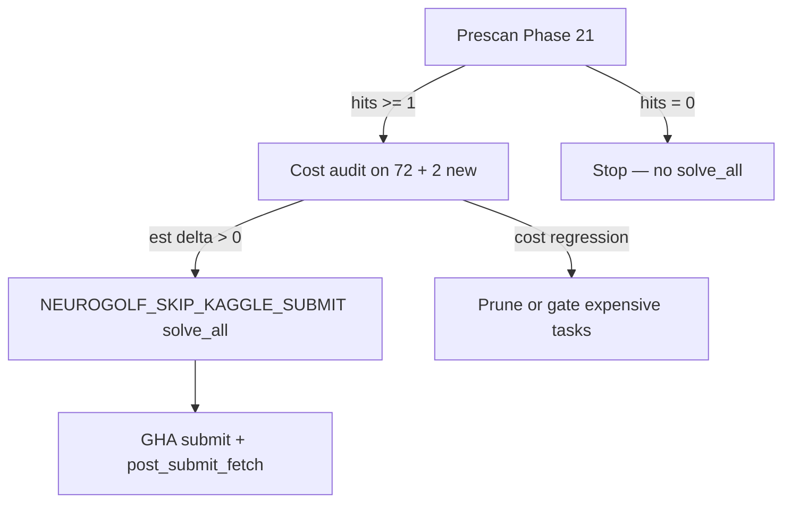

# Strategy — June 29, 2026

## Situation

- **Baseline:** 940.75 Kaggle, 72 `pass_all` (submission-2, 2026-06-26).
- **328 unsolved** tasks remain.
- Phases 18–20 (object programs, place, depth-2 compose) all prescan **0** on unsolved.
- Near-miss tasks **32** and **78** matched gravity rules in numpy but failed **static gather** compile.

## Root cause (compose near-misses)

| Failure mode | Example |
|--------------|---------|
| Variable grid shape (4×4 / 5×5 / 6×6) | Task 32 |
| Per-input column occupancy (empty col in one example, filled in another) | Task 78 |
| Dynamic rule, static index map | Any pure gravity |

**Do not** flat-submit when prescan = 0. **Do** invest in compilers that match the true runtime rule.

## Phase 21 bet — dynamic gravity ONNX

```text
train+test+ARC-GEN  →  fit rule (gravity_up/down)
                   →  max_grid_extent(task) bounds graph size
                   →  build_gravity_model(direction, max_h, max_w)
                   →  validate_full
```

### Why it works

1. **Colored occupancy** = sum of channels 1–9 (background ch0 excluded).
2. **Grid extent** `gh, gw` = runtime bbox of any in-grid cell (incl. background), from `ReduceMax` + bbox scalars (same pattern as Phase 11 bounded flip).
3. **Per output cell** `(r,c)`: find source row `s` where cumsum column rank matches; weighted gather across channels.
4. **Compile-time** `max_h, max_w` from train+test caps loops (task 32 → 6×6, task 78 → 10×10), keeping graphs ~50k–165k nodes vs millions at full 30×30 unroll.

## Decision tree (submission-3)



## Prescan result (2026-06-29)

- **+2 hits:** tasks **32**, **78**
- Compose / object / place: still 0 incremental
- **Gate cleared** for cost audit → solve_all

## Risks

| Risk | Mitigation |
|------|------------|
| High ONNX node count (~165k task 78) | Official cost audit before submit; compare vs conv fallback |
| Left/right gravity not implemented | Only up/down in `ARCgen_GRAVITY_SOLVERS` for now |
| More gravity tasks need flip∘gravity chains | Phase 20 compose + Phase 21 gravity compiler stack |

## Next levers (priority)

1. **Cost audit** on tasks 32, 78 models — confirm positive Kaggle delta.
2. Run **submission-3** `solve_all` if audit passes.
3. Extend dynamic gravity to **left/right** if prescan shows hits.
4. **Compose + dynamic gravity** — compile flip as static gather ∘ dynamic gravity (task 32 also matches `flip_h → gravity_down` in numpy).

## LoRA / agent loop

Document prescan hits in `kaggle-submissions/AGENT_STATE.md` so Agent 1 picks submission-3 lane. Strategize adapter should learn: *dynamic rule → dynamic ONNX, not gather stretch*.
