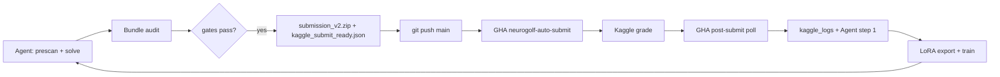

# Workflow — June 29, 2026

## Intended automatic loop



## Methods we used today

### 1. Prescan discipline

Before any `solve_all` or submit:

```bash
set_phase(N)
# run prescan solvers on 328 unsolved only
```

Reject phases with **0 hits** on unsolved (Phases 18–20).

### 2. ARC-GEN validation

Every candidate ONNX must pass `validate_full` (train + test + ARC-GEN[:100]).

### 3. Solver stack (priority, Phase 21)

| Order | Solver family |
|------:|---------------|
| 1 | `gravity_*_dynamic` (Phase 21) |
| 2 | `compose_arcgen` (Phase 20) |
| 3 | `ARCgen_PLACE_SOLVERS` (19) |
| 4 | `ARCgen_OBJECT_SOLVERS` (18) |
| 5 | `ARCgen_GATHER_SOLVERS` (15–17) |
| 6 | bounded / analytical / conv |

### 4. Bundle build (submission-3)

When prescan finds **K** new tasks and baseline is stable:

1. Seed **72** ONNX from submission-2
2. Compile **K** new models (tasks 32, 78)
3. `audit_submission.py` on 74 files
4. `make_submission_zip`
5. Submit if gates pass

Skip full 400-task `solve_all` when seeds are unchanged and audit passes.

### 5. Submit gates

```text
train_only == 0
AND (pass_all > baseline_tasks OR kaggle_score_est >= baseline_est + 1.0)
```

submission-3: `74 > 72` and `est 1115 > 1092` → **PASS**

### 6. Submit paths (dual)

| Path | When |
|------|------|
| **Local** | `scripts/kaggle_auto_submit.py` — default in run scripts |
| **GHA** | Push `kaggle_submit_ready.json` → `neurogolf-auto-submit.yml` |

Set `NEUROGOLF_SKIP_KAGGLE_SUBMIT=1` to force GHA-only (CI environments).

### 7. LoRA loop

After each scored submission:

```bash
python scripts/export_lora_training_row.py diagnose ...
python scripts/export_lora_training_row.py strategize ...
python scripts/bootstrap_lora_training_data.py --adapter all
python scripts/train_lora.py --adapter all
```

GHA `neurogolf-train-lora.yml` runs on push to `training/lora-*/examples/**`.

Adapters must learn: **dynamic rule → dynamic ONNX**, prescan before solve, score_up vs score_flat outcomes.

## Agent 1 steps (summary)

See `docs/agent1/instructions.md`:

1. Fetch `kaggle_logs` after submit
2. **Diagnose** → `analysis.md` + LoRA row
3. **Strategize** → `plan.md` + LoRA row
4. **Implement** → run script + LoRA row
5. Solve / package / submit
6. Push → GHA chains post-submit

## Files produced per submission

| File | Purpose |
|------|---------|
| `prescan.json` | Gate record |
| `cost_audit_bundle.json` / `audit.json` | Official scores |
| `submission_v2.zip` | Kaggle upload |
| `kaggle_submit_ready.json` | GHA trigger |
| `results.json` | `submitted`, scores, phase |
| `analysis.md` | Diagnose LoRA input |
| `plan.md` / `strategy.md` | Strategize LoRA input |
